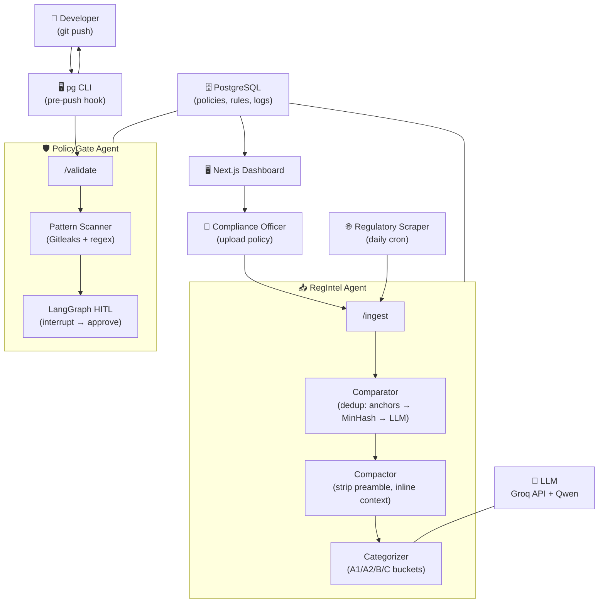

# FerretOPS

**"From Periodic Audit to Continuous Certainty."**
*Agentic DevSecOps compliance platform — policies to guardrails, built on AMD.*

[](LICENSE)
[](https://www.amd.com/en/corporate/hackathon.html)

---

## Overview

FerretOPS ingests internal policies and external regulations, normalises them into machine-readable guardrails, and enforces them automatically across your delivery pipeline. *Audits shrink from weeks to hours. Every commit is checked. Compliance shifts from point-in-time panic to always-on certainty.*

**Built in 5 days for the AMD Developer Hackathon 2026.**

---

## Architecture



1. **RegIntel** ingests policies (PDF/Markdown upload or scraper), deduplicates via three‑tier Comparator, compacts via LLM, and categorizes rules into A1 (Scannable), A2 (Actionable), B (Infra), C (Semantic) buckets — stored in PostgreSQL.
2. **PolicyGate** serves rules to the CLI and validates flagged code via the `/validate` endpoint with LLM‑backed reasoning.
3. **The `pg` CLI** fetches A1 regex rules, scans staged diffs locally with Gitleaks + built‑in patterns + entropy scoring, and blocks high‑risk pushes before they reach remote.
4. **Human‑in‑the‑Loop** pauses medium‑risk validations for manager approval via LangGraph interrupts — fully logged.

---

## Features

- 🔍 **Pre‑push secret & pattern detection** — Gitleaks + custom regex + entropy scoring
- 📥 **Policy intake** — PDF / Markdown upload and regulatory website scraping
- 🧠 **AI‑powered classification** — LLM extracts rules into A1/A2/B/C buckets with regex generation
- 🛡️ **Automatic enforcement** — CLI blocks high‑risk commits before push; backend validates uncertain cases
- 🧑‍⚖️ **Human‑in‑the‑loop approval** — LangGraph interrupts for medium‑risk decisions with full audit trail
- 📊 **Real‑time dashboard** — compliance health, violation history, pending approvals, policy inventory

> **Roadmap:** AuditGen (one‑click SOC2/GDPR evidence packs), insider threat guardrails, enterprise multi‑tenancy.

---

## Tech Stack

| Layer             | Technology                                  |
| :---------------- | :------------------------------------------ |
| AI Model          | Qwen 3.5 (via Groq API)                     |
| Agent Framework   | LangGraph (Python)                          |
| Backend           | FastAPI, Docker                             |
| Database          | PostgreSQL                                  |
| Frontend          | Next.js, TailwindCSS                        |
| CLI               | Go (`pg`)                                   |
| CI/CD             | GitHub Actions, Docker Compose              |

---

## Repository Structure

```
complyaigent/
├── backend/
│   ├── app/
│   │   ├── api/               # REST endpoints (ingest, manifest, validate)
│   │   ├── models/            # SQLModel entities
│   │   ├── services/          # Comparator, Compactor, Categorizer, Validator
│   │   ├── core/              # Config, DB, logging
│   │   └── worker/            # Background task orchestration
│   └── tests/
├── cli/                       # Go CLI (pg) — pre‑push hook
├── frontend/                  # Next.js dashboard
├── docker/
│   ├── docker-compose.yml     # Development stack
│   └── docker-compose.prod.yml # Production‑like stack
├── docs/                      # PRD, architecture diagrams, pitch deck
├── specs/                     # spec‑kit artifacts (spec, plan, tasks)
├── .github/workflows/         # CI
├── README.md
└── LICENSE
```

---

## Getting Started

```bash
# 1. Clone and enter the repo
git clone https://github.com/kuya-carlo/complyaigent.git && cd complyaigent

# 2. Start all services
docker compose -f docker/docker-compose.yml up --build -d

# 3. Verify
curl http://localhost:8000/health          # → {"status":"healthy"}
curl http://localhost:8000/reg             # → {"buckets": {"A1": [...], ...}}

# 4. Ingest a policy
curl -X POST http://localhost:8000/ingest \
  -F "file=@docs/constitution.md"

# 5. Poll until complete
curl http://localhost:8000/ingest/{task_id}

# 6. Fetch rules with the CLI
cd cli && go build -o pg . && ./pg fetch

# 7. Scan a commit
./pg scan
```

### Frontend Development

```bash
cd frontend
npm install
npm run dev
# → http://localhost:3001
```

---

## Team

| Name | Role |
| :--- | :--- |
| @kuya-carlo | Infra/DevOps Lead, CLI, system glue |
| @NanaMein | RegIntel backend (FastAPI, RAG, LangGraph) |
| @donutellah | AI & data engineering, prompt design |
| @itsm3Glenn | Frontend lead (Next.js, TailwindCSS) |
| @Polqt | PolicyGate backend (scanning, validation) |

---

## Hackathon Context

**AMD Developer Hackathon — May 4–10, 2026**
*Submission deadline: May 10, 5:00 AM PHT*

Built with AMD-ready architecture. LLM workloads run via API (Groq) during the hackathon; the stack is containerized and deployable to AMD MI300X instances for full‑precision inference with ROCm and vLLM.

---

## Roadmap

- [ ] **AuditGen** — auto‑generate framework‑mapped evidence packs (SOC2, GDPR, PCI‑DSS)
- [ ] **Insider threat guardrails** — ephemeral credentials, access anomaly detection
- [ ] **Enterprise SaaS** — SSO, dedicated tenants, on‑premise deployment

---

## License

MIT — see [LICENSE](LICENSE).

---

*Built with ❤️, caffeine, and a lot of `--no-verify`.*
