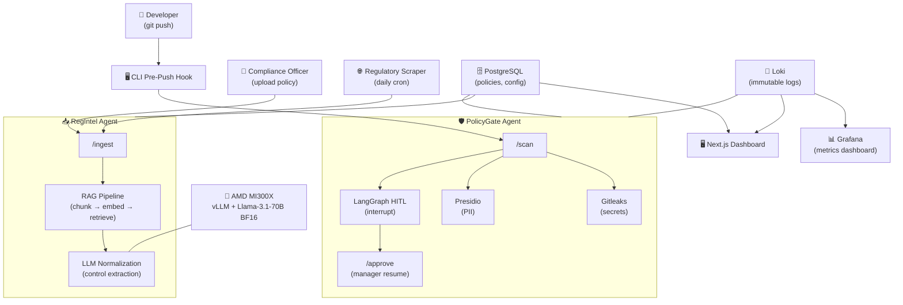

# 🛡️ ComplyAIgent

**"From Periodic Audit to Continuous Certainty."**  
*Agentic DevSecOps compliance platform — policies to guardrails, powered by AMD MI300X.*

[](LICENSE)
[](https://www.amd.com/en/corporate/hackathon.html)

---

## Overview

ComplyAIgent ingests internal policies and external regulations, normalises them into machine‑readable guardrails, and enforces them automatically across your delivery pipeline.  
*Audits shrink from weeks to hours. Every commit is checked. Compliance shifts from point‑in‑time panic to always‑on certainty.*

---

## Architecture



1. **RegIntel** ingests policies (manual upload or scraper), runs a RAG pipeline on AMD MI300X, and stores structured controls in PostgreSQL.  
2. **PolicyGate** reads those policies, scans every `git push` for secrets and PII, and blocks or warns accordingly.  
3. **Human‑in‑the‑Loop** pauses medium‑risk actions for manager approval via LangGraph – fully logged to Loki.

---

## Features

- 🔍 **Pre‑push secret & PII detection** (Gitleaks + Microsoft Presidio)  
- 📥 **Policy intake** from PDF / Markdown uploads and regulatory website scraping  
- 🧠 **AI‑powered normalisation** – LLM extracts actionable controls into JSON  
- 🛡️ **Automatic enforcement** – policies become guardrails in Git and CI/CD  
- 🧑‍⚖️ **Human‑in‑the‑loop approval** with full audit trail  
- 📊 **Real‑time dashboards** – compliance health, violations, drift alerts  

> **Coming next:** AuditGen (one‑click SOC2/GDPR evidence packs), insider threat guardrails, enterprise multi‑tenancy.

---

## Tech Stack

| Layer             | Technology                                  |
| :---------------- | :------------------------------------------ |
| AI Hardware       | AMD MI300X (192 GB HBM3), ROCm, vLLM        |
| AI Model          | Llama‑3.1‑70B (BF16, full precision)        |
| Agent Framework   | LangGraph (Python)                          |
| Backend           | FastAPI, Docker                             |
| Database          | PostgreSQL, DuckDB (analytics)              |
| Observability     | Grafana, Prometheus, Loki                   |
| Frontend          | Next.js, TailwindCSS                        |
| CLI Hook          | Python (`policygate`)                       |
| CI/CD             | GitHub Actions, Docker Compose              |

---

## Repository Structure

```
complyaigent/
├── backend/
│   ├── app/
│   │   ├── regintel/          # Ingestion, RAG, policy normalisation
│   │   └── policygate/        # Scanning, HITL, enforcement API
│   └── tests/
├── cli/                       # Pre‑push CLI hook
├── frontend/                  # Next.js dashboard
├── docker/
│   └── docker-compose.yml     # One‑command local stack
├── docs/                      # PRD, architecture diagrams, pitch deck
├── .github/workflows/         # CI
├── README.md
└── LICENSE
```

---

## Getting Started (Local MVP)

```bash
# 1. Clone and enter the repo
git clone https://github.com/kuya-carlo/complyaigent.git && cd complyaigent

# 2. Start all services
docker compose -f docker/docker-compose.yml up -d

# 3. Verify health
curl http://localhost:8000/health         # → {"status":"ok"}
open http://localhost:3000                # Grafana
open http://localhost:3001                # Next.js dashboard
```

To switch to AMD GPU inference once credits are active:
```bash
export LLM_ENDPOINT=http://your-amd-instance:8000/v1
docker compose -f docker/docker-compose.yml up -d --force-recreate
```

---

## Team

| Name | Role |
| :--- | :--- |
| Karlo Santos | Infra/DevOps Lead, system glue |
| Alfeo (Nana) | RegIntel backend (FastAPI, RAG, LangGraph) |
| Ellah | AI & data engineering, prompt design |
| Glenn | Frontend lead (Next.js, TailwindCSS) |
| Jepoy | PolicyGate backend (scanning, HITL) |
| Leofer | Design, slide deck, demo video |

---

## Hackathon Context

**AMD Developer Hackathon – May 4–10, 2026**  
*Submission deadline: May 10, 5:00 AM PHT*

---

## Roadmap

- [ ] **AuditGen** – auto‑generate framework‑mapped evidence packs  
- [ ] **Insider threat guardrails** – ephemeral credentials, access anomaly detection  
- [ ] **Enterprise SaaS** – SSO, dedicated MI300X tenants  

---

## License

MIT – see [LICENSE](LICENSE).
