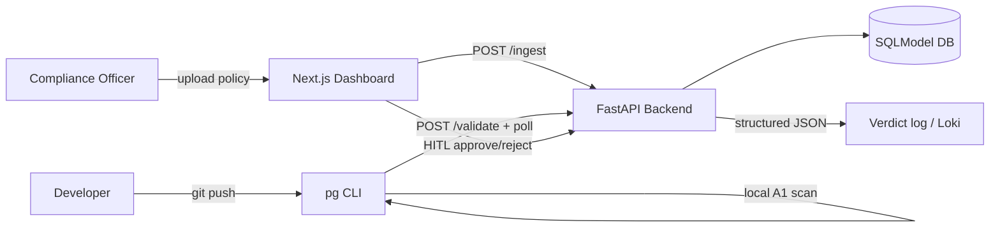

# ComplyAIgent Roadmap

> **Goal right now:** ship an **MVP** — a working continuous compliance gate, not a hackathon demo pack.
> **Tracking:** GitHub Project [ComplyAIgent Roadmap](https://github.com/orgs/liitkud/projects/2) · Epic [#74](https://github.com/liitkud/complyaigent/issues/74) · [`docs/mvp/`](mvp/).

## North star (MVP)

A compliance officer can **ingest a policy**, a developer’s **pre-push CLI** enforces scannable rules and offloads uncertain diffs to the backend, and the officer can **approve/reject** pending validations on the dashboard — with **structured verdict logs** retained for audit.

## Status snapshot (2026-07-24)

| Area | State |
|------|--------|
| CLI ↔ `/validate` contract | Done (poll `GET /validate/{id}`) |
| Lazy LLM clients | Done |
| Integration test schemas | Done |
| Backend CI (`ruff` / `ty`) | Green on `dev` |
| Policy versioning | Open — MVP |
| Loki / structured verdicts | Open — MVP |
| Presidio PII | Open — MVP |
| HITL against live API E2E | Needs hardening — MVP |
| Load test / RAG tune / reg simulator | Deferred post-MVP |

## Phases

### Phase 0 — Stabilize (done)
Contract fixes, CI green, remove hackathon-only backlog noise.

### Phase 1 — MVP vertical slice *(current)*
See [docs/mvp/README.md](mvp/README.md) and the MVP epic on GitHub.

### Phase 2 — Harden
Load test (&lt;5s), RAG chunk tuning, regulatory drift simulator, richer dashboard.

### Phase 3 — Operate
Deploy profiles, retention, multi-tenant / multi-repo (out of scope until Phase 2 proves value).

## Non-goals (for MVP)

- Pitch decks / slide design
- AMD-specific swap-in proxy as a deliverable
- Perfect RAG accuracy
- Multi-region / SaaS packaging
