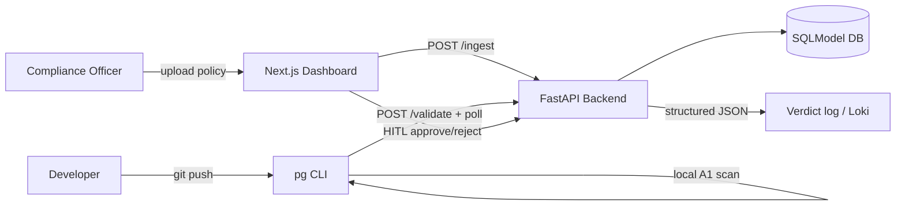

# ComplyAIgent Roadmap

> **Goal right now:** ship an **MVP** — a working continuous compliance gate, not a hackathon demo pack.
> **Tracking:** GitHub Project [ComplyAIgent Roadmap](https://github.com/orgs/liitkud/projects/2) · Epic [#74](https://github.com/liitkud/complyaigent/issues/74) · [`docs/mvp/`](mvp/).
> **Product name:** ComplyAIgent (no FerretOps rename).

## North star (MVP)

A compliance officer can **ingest a policy**, a developer’s **pre-push CLI** enforces scannable rules and offloads uncertain diffs to the backend, and the officer can **approve/reject** pending validations on the dashboard — with **structured verdict logs** retained for audit.

## Status snapshot (2026-08-10)

| Area | State |
|------|--------|
| CLI ↔ `/validate` contract | Done on `dev` (poll `GET /validate/{id}`) |
| Lazy LLM clients | Done on `dev` |
| Integration test schemas | Done on `dev` |
| Backend CI (`ruff` / `ty`) | Green baseline on `dev`; MVP PRs may still fail until CI fix lands |
| Policy versioning + fixtures + verdict schema | Delivered on tip — [#86](https://github.com/liitkud/complyaigent/pull/86) open |
| Loki / structured verdict push | Delivered on tip — [#89](https://github.com/liitkud/complyaigent/pull/89) open |
| Presidio / regex PII | Delivered on tip — [#90](https://github.com/liitkud/complyaigent/pull/90) open |
| HITL against live API + compose E2E | Delivered on tip — [#91](https://github.com/liitkud/complyaigent/pull/91) open |
| A1 regex ReDoS gate | Open — [#80](https://github.com/liitkud/complyaigent/issues/80) |
| `pg init` full pre-push in smoke | Open |
| Load test / RAG tune / reg simulator | Deferred post-MVP |

## Phases

### Phase 0 — Stabilize (done)
Contract fixes, CI green, remove hackathon-only backlog noise.

### Phase 1 — MVP vertical slice *(current)*
See [docs/mvp/README.md](mvp/README.md) and the MVP epic on GitHub. Merge order: **#86 → #89 / #90 / #91**.

### Phase 2 — Harden
Load test (&lt;5s), RAG chunk tuning, regulatory drift simulator, richer dashboard.

### Phase 3 — Operate
Deploy profiles, retention, multi-tenant / multi-repo (out of scope until Phase 2 proves value).

## Non-goals (for MVP)

- Pitch decks / slide design
- AMD-specific swap-in proxy as a deliverable
- Perfect RAG accuracy
- Multi-region / SaaS packaging
- Renaming the product to FerretOps
